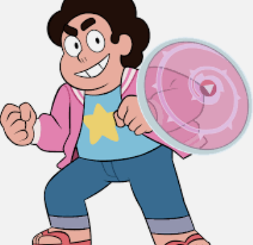

# Web APIs & NLP in Animation Subreddit's
 
 
## Problem Stament: 

The goal of project was to create a classification model to predict where a post originated from r/cartoons or r/anime.

1. We try to find the most important words in classifying posts. 
2. Deduce why those word are deemed important by the model.
## Methods:
Use Reddit’s API to web scrape from our subreddit of interest.
1. We then focus on the title of the posts and selftext for analysis
2. We run two models:
3. Naive Bayes with Count Vectorized
4. Naive Bayes with TF-IDF
